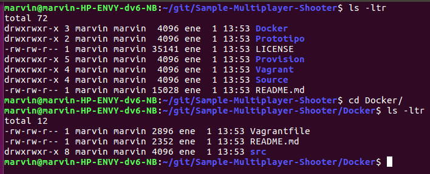
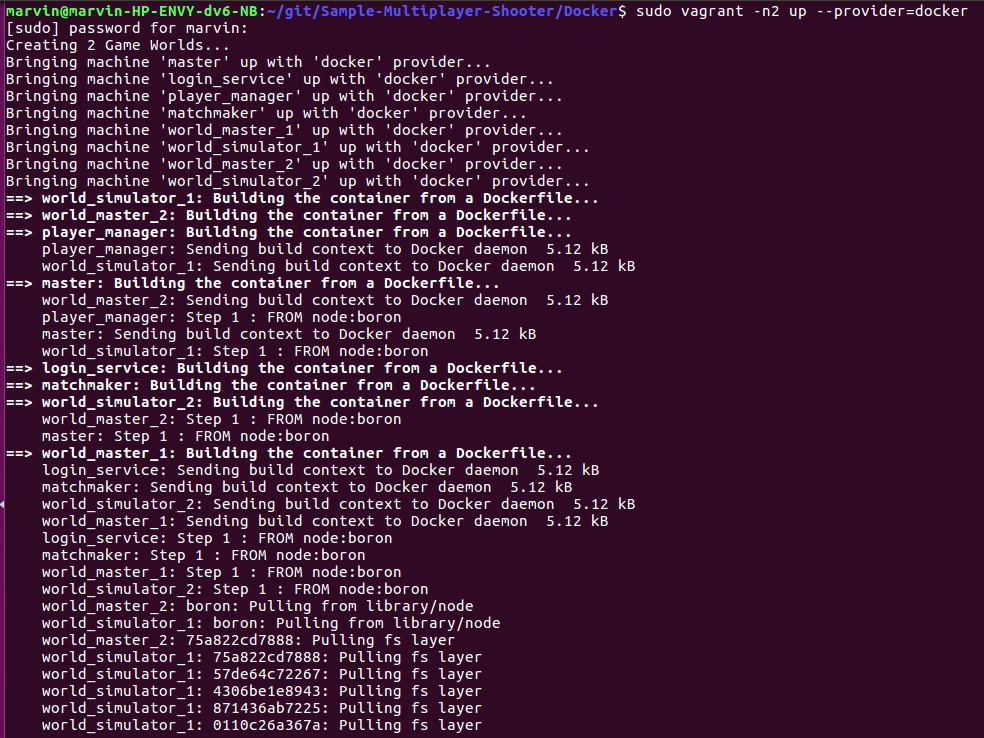
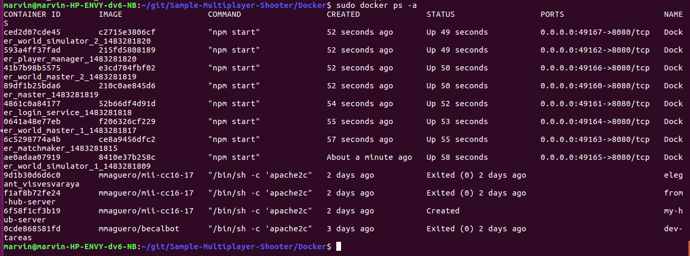

#Corrección de Contenedores/Docker de otro compañero

Se comprueba el funcionamiento exitoso de *Contenedores/Docker* del compañero @NestorsImagination para su [proyecto](https://github.com/NestorsImagination/Sample-Multiplayer-Shooter/tree/master/Docker), funciona correctamente, sin ningún sobresalto, exacto los comunes de configurar los parámetros adecuados p/ su ejecución en mi entorno.

