# Contenedores (Virtualización ligera usando contenedores)

## Ejercicios

* [x] 1. Instala LXC en tu versión de Linux favorita. Normalmente la versión en desarrollo, disponible tanto en GitHub como en el sitio web está bastante más avanzada; para evitar problemas sobre todo con las herramientas que vamos a ver más adelante, conviene que te instales la última versión y si es posible una igual o mayor a la 2.0.

* [x] 2. Instalar una distro tal como Alpine y conectarse a ella usando el nombre de usuario y clave que indicará en su creación.

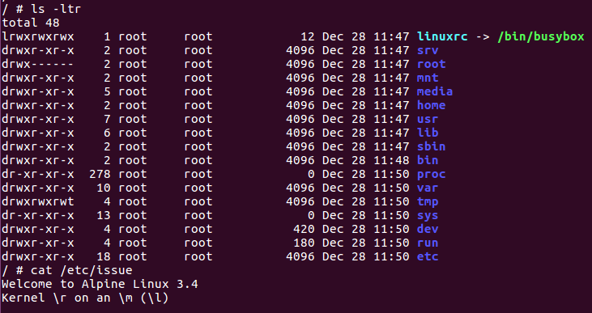

* [X] 3. Provisionar un contenedor LXC usando Ansible o alguna otra herramienta de configuración que ya se haya usado.

Utilicé Vagrant y Ansible, clic [aquí](EJ3/) para ver los ficheros implicados.

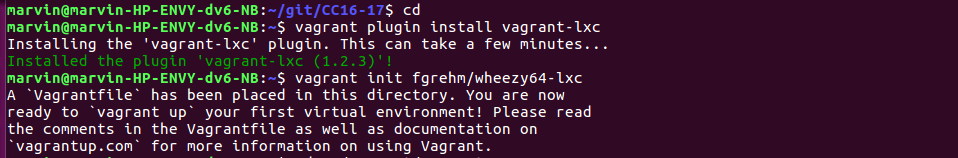
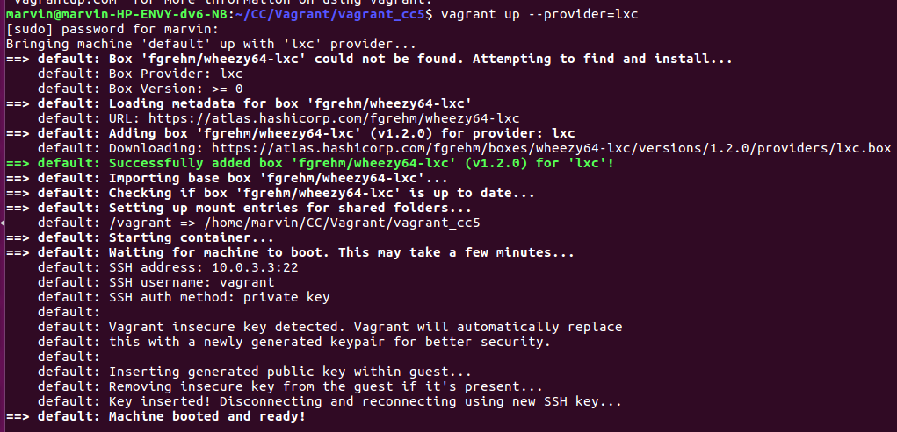
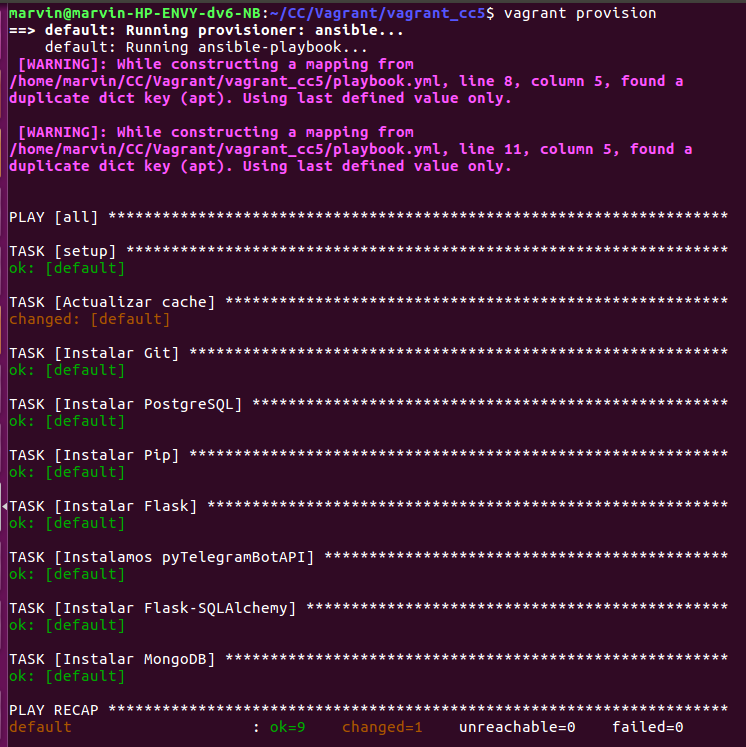

* [x] 4. Instalar una imagen alternativa de Ubuntu y alguna adicional, por ejemplo de CentOS.

* [x] 5. Crear a partir del contenedor anterior una imagen persistente con commit.

### Hito 4

* [x] 6. Reproducir los contenedores creados anteriormente usando un Dockerfile.

Se puede ver el Dockerfile [aquí](https://github.com/mmaguero/MII-CC16-17/blob/master/Dockerfile).

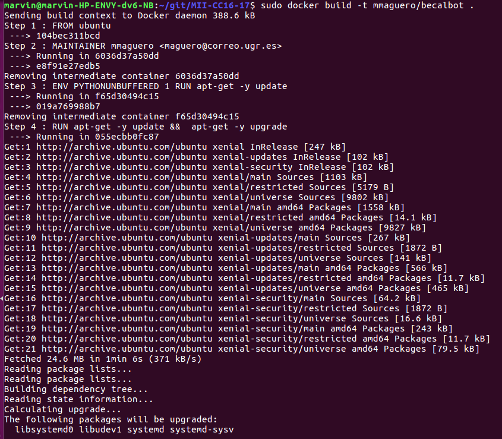
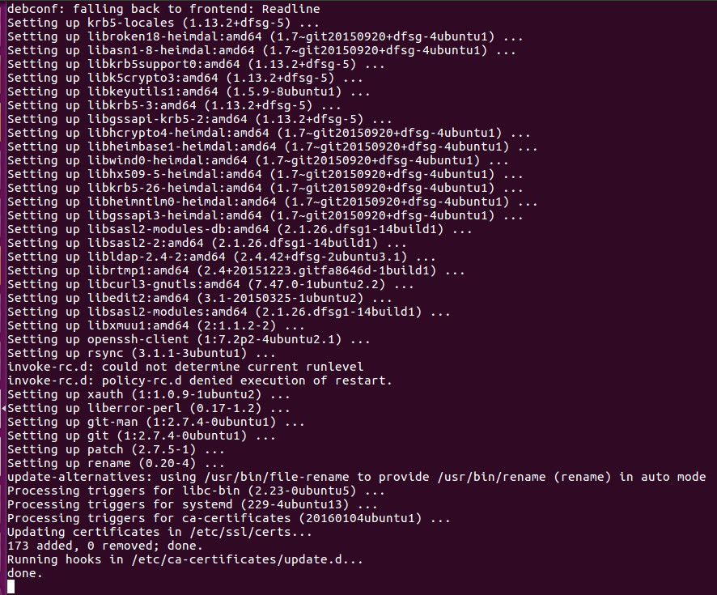
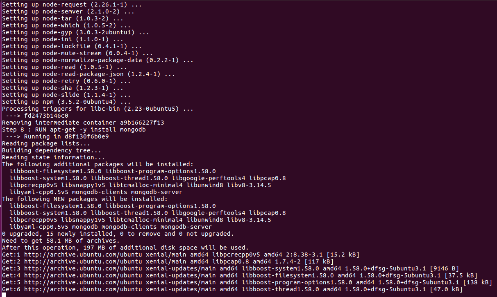
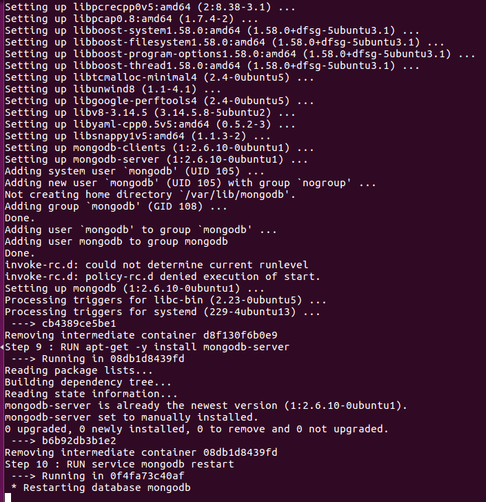
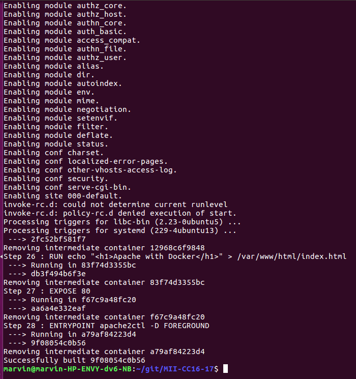
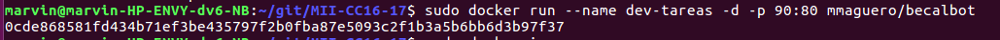

Como en el Dockerfile instalamos un servidor de apache, lo levantamos, el resultado es este...

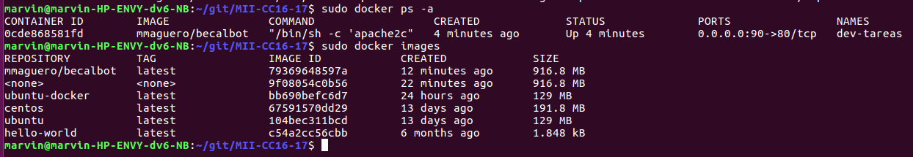
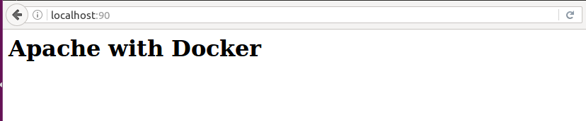

* [x] 7. Crear con docker-machine un entorno local y ejecutar en él contenedores creados con antelación.

 En este caso opté por hacerlo en la cloud con [docker-machine](https://docs.docker.com/machine/examples/aws/), para luego instanciar con una imagen creada para Docker Hub en el [hito 4](https://github.com/mmaguero/MII-CC16-17/tree/master/contenedor)

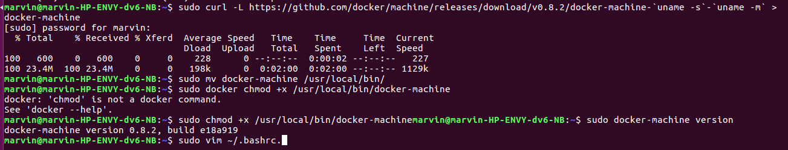
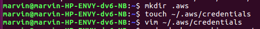
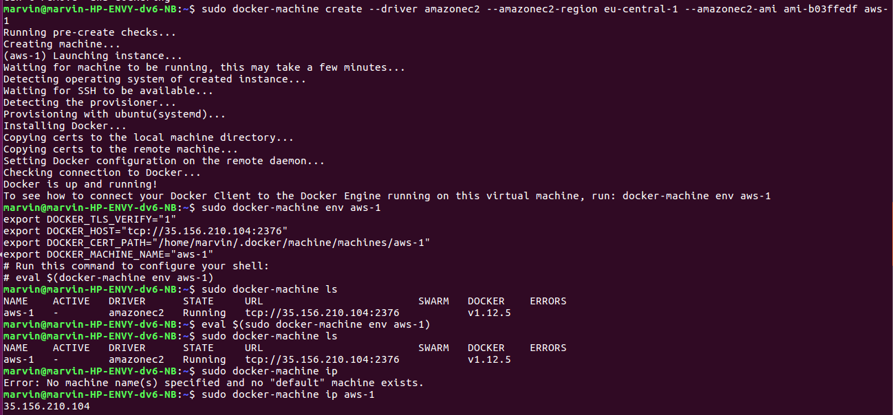
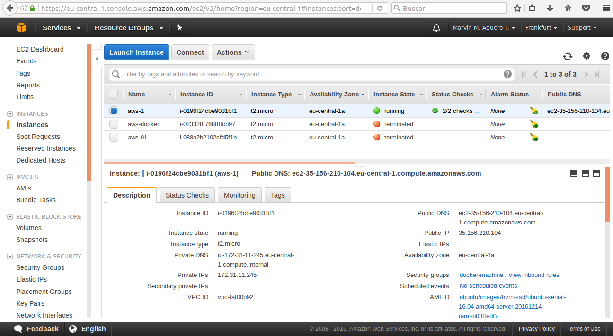
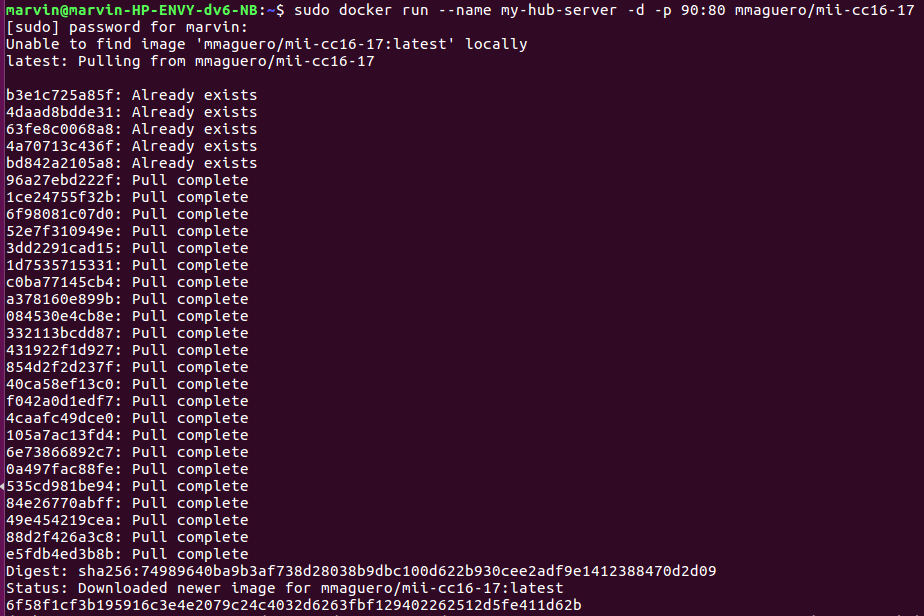

