# Contenedores (Virtualización ligera usando contenedores)

## Ejercicios

* [x] 1. Instala LXC en tu versión de Linux favorita. Normalmente la versión en desarrollo, disponible tanto en GitHub como en el sitio web está bastante más avanzada; para evitar problemas sobre todo con las herramientas que vamos a ver más adelante, conviene que te instales la última versión y si es posible una igual o mayor a la 2.0.

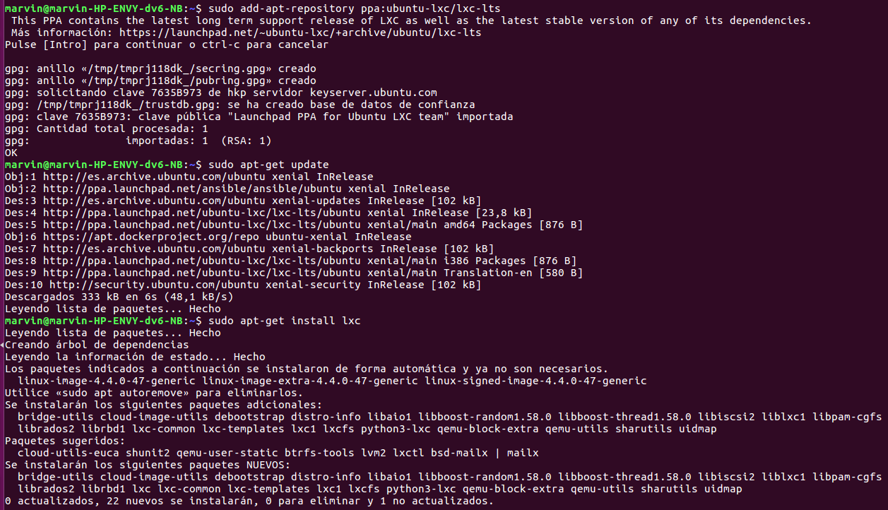
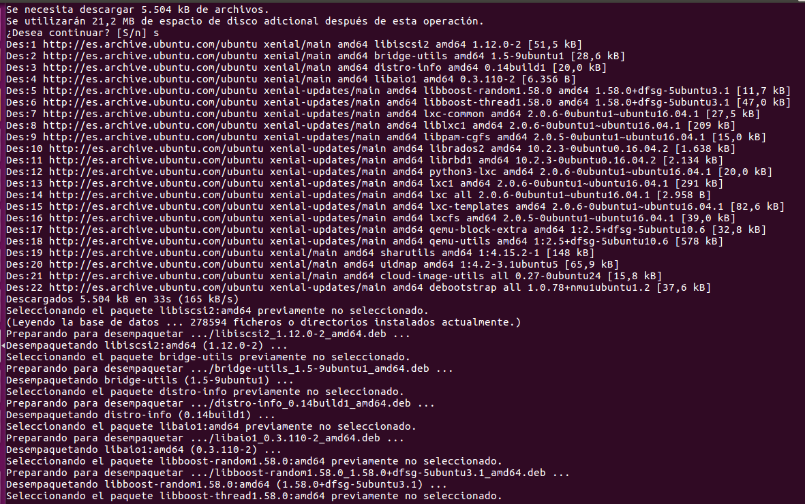
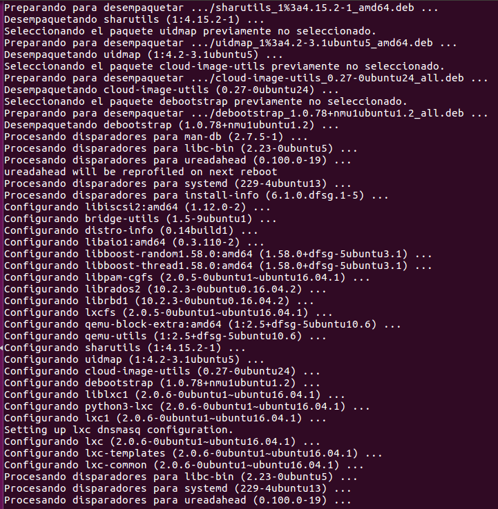
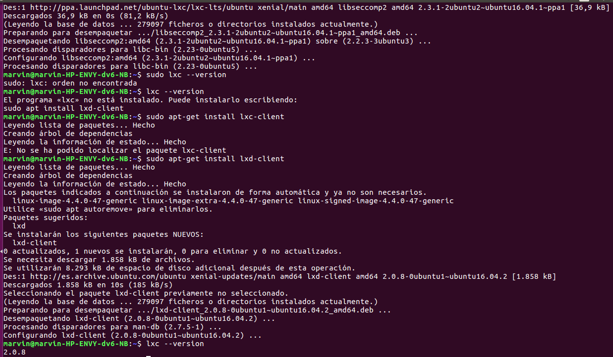

* [x] 2. Instalar una distro tal como Alpine y conectarse a ella usando el nombre de usuario y clave que indicará en su creación.

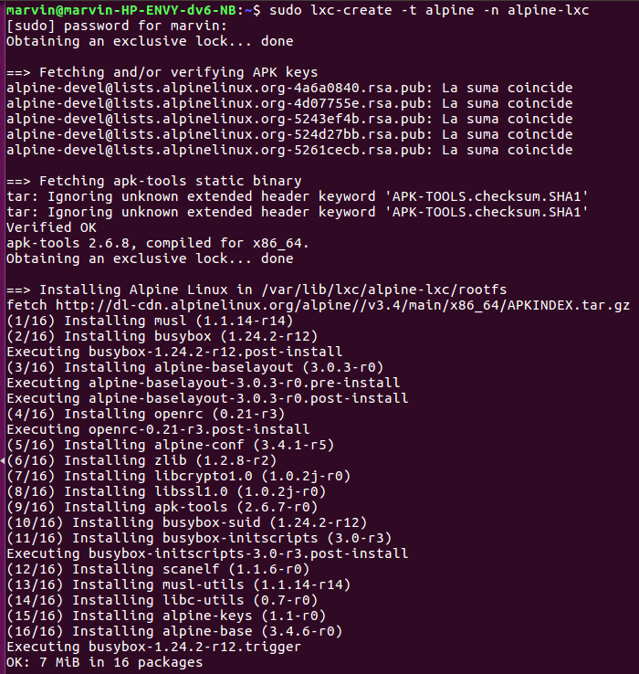
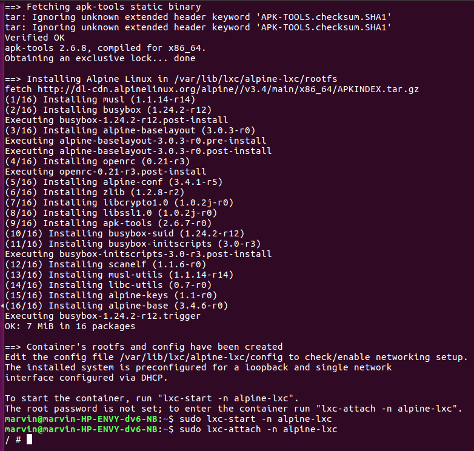

* [ ] 3. Provisionar un contenedor LXC usando Ansible o alguna otra herramienta de configuración que ya se haya usado.

* [x] 4. Instalar una imagen alternativa de Ubuntu y alguna adicional, por ejemplo de CentOS.

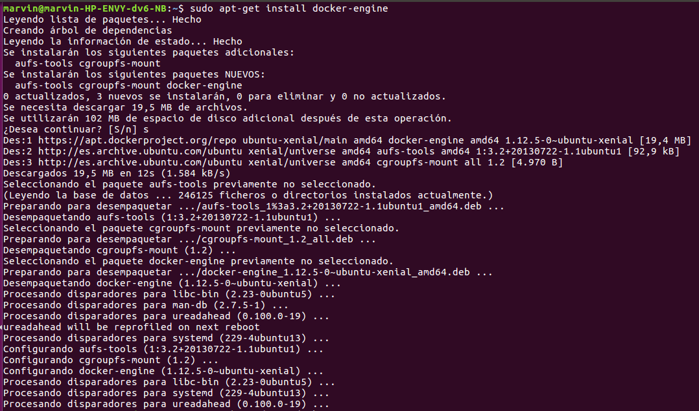
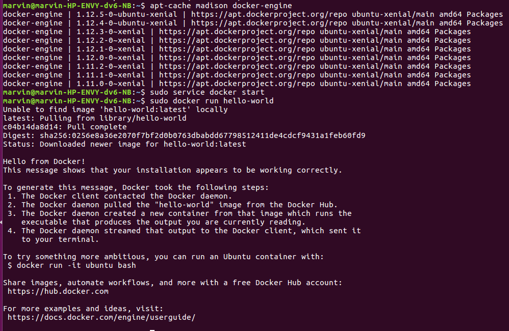
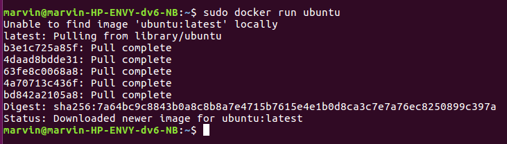
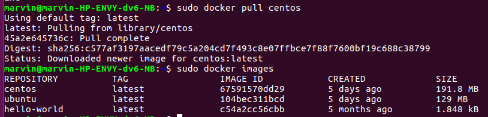

* [x] 5. Crear a partir del contenedor anterior una imagen persistente con commit.

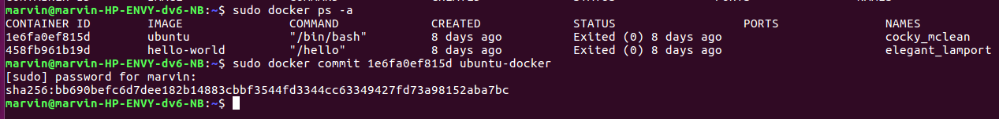
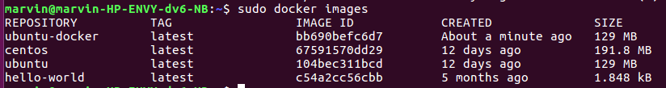

